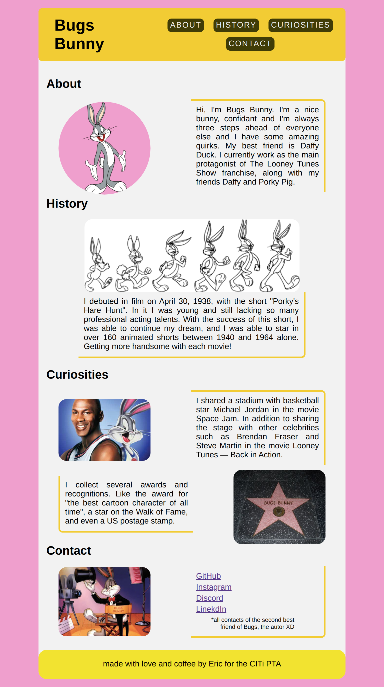

#  Bugs Bunny - OnePage

#
### A simple web page dedicated to Bugs Bunny. Made as part of the PTA (Training Process) of the [CITi](https://citi.org.br/) (Integrated Center for Information Technology).

>  You can check the result by [clicking here](https://ericxlima.github.io/bugs-bunny-onepage/)

#
- ### Objectives:

    - [x] Contents: descriptions, pictures, links...
    - [x] Use only HTML and CSS
    - [x] Navbar
    - [x] Use pseudo classes for CSS
    - [x] Extra section (creativity)
    - [ ] Hamburger menu
    - [x] Footer section
    - [x] Responsiveness (Desktop and Mobile)
    - [x] Animation with CSS
    - [x] Banner
    - [x] To use flex-container

#
### Preview:

#
## Author
|  |
| :----: |
| [Eric de Lima](https://github.com/ericxlima) |
